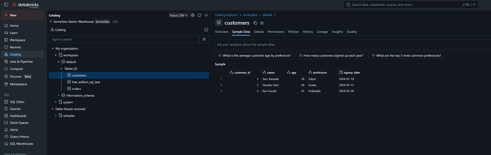

# study-databricks-import

Databricks Free Edition だけを使い、ローカルから SQL Warehouse へ接続して疎通確認と最小 SQL 操作を学ぶための学習リポジトリ。

## 0. 最重要前提

このリポジトリは **Databricks Free Edition のみ利用可能** という制約を前提にする。

そのため、以下を前提にしない。

- Databricks Free Trial
- 有償 workspace
- 管理者権限のある通常環境
- Databricks Connect が確実に使える前提
- GCS external location / volume を簡単に使える前提

このリポジトリの Databricks 主導線は、**Serverless SQL Warehouse にローカルから接続して SQL を実行すること** である。



## 1. ゴール

まずは以下ができれば成功。

- Databricks Free Edition にログインできる
- SQL Warehouse の `Connection details` を取得できる
- ローカルから `SELECT 1` を実行できる
- `current_catalog()` を確認できる
- `CREATE TABLE AS SELECT` が通ることを確認できる
- `customers` / `orders` を SQL の `VALUES` で再現できる

## 1.1 確認済み実績

このリポジトリでは、Databricks Free Edition に対して以下の実行成功を確認済み。

- `doppler run -- make sql-test`
- `doppler run -- make sql-catalog`
- `doppler run -- make sql-ctas`
- `doppler run -- make sql-values`

確認できた内容:

- `SELECT 1 AS ok` が返る
- `current_catalog() = workspace`
- `CREATE SCHEMA IF NOT EXISTS workspace.default` が通る
- `CREATE OR REPLACE TABLE workspace.default.free_edition_sql_test AS SELECT 1 AS ok` が通る
- `SELECT * FROM workspace.default.free_edition_sql_test` で `Row(ok=1)` が返る
- `data/` は参照用 fixture として保持し、Databricks には `VALUES` で再現する方針
- `workspace.default.customers` と `workspace.default.orders` が作成される
- JOIN 集計結果として `Taro Yamada / 2件 / 20000`、`Hanako Sato / 1件 / 15000`、`Ken Suzuki / 1件 / 6000` を確認できる

このため、**Databricks Free Edition の SQL Warehouse を使った最小 SQL 学習導線は確認済み仕様** とする。

## 2. ディレクトリ構成

```text
study-databricks-import/
  README.md
  pyproject.toml
  .gitignore
  Makefile
  doppler.yaml
  data/
    customers.csv
    orders.csv
    events.json
    products.parquet
  databricks/
    README.md
    notebooks/
      01_volume_json_to_delta.py
    sql/
      01_connectivity.sql
      02_catalog.sql
      03_ctas.sql
      04_values_seed.sql
      05_create_managed_volume.sql
      06_verify_events_from_volume.sql
  docs/
    01_goal.md
    02_managed_volume_validation.md
  scripts/
    databricks_sql_test.sh
  src/
    study_databricks_import/
      __init__.py
      sql_connectivity.py
```

## 3. Free Edition 確実ルート

### 3.1 依存を入れる

```bash
cd /home/ubuntu/repos/study-databricks-import
python3 -m venv .venv
source .venv/bin/activate
pip install -e .
```

### 3.2 接続情報を取得する

Databricks Free Edition の `SQL Warehouses` から `Connection details` を開き、以下を控える。

- `Server hostname`
- `HTTP path`

さらに `sql` scope の Personal Access Token を作る。

### 3.3 Doppler を設定する

このリポジトリでは token を **人手で shell export しない**。

`doppler.yaml` では最低限、以下の secret を前提にする。

- `DWH_DATABRICKS_TOKEN`

`Server hostname` と `HTTP path` は、今の Free Edition 値を `Makefile` にデフォルトで持たせている。

初期化例:

```bash
doppler setup --project kuro-dev-k --config dev --no-interactive
```

### 3.4 疎通確認

最初の成功確認はこれ。

```bash
doppler run -- make sql-test
```

または、Doppler を shell に inject 済みなら:

```bash
make sql-test
```

期待結果:

```text
Databricks SQL connectivity succeeded.
Query: SELECT 1 AS ok
Rows: [Row(ok=1)]
```

### 3.5 catalog 確認

```bash
doppler run -- make sql-catalog
```

期待例:

```text
Databricks SQL catalog query succeeded.
Rows: [Row(current_catalog='workspace')]
```

### 3.6 最小 CTAS 確認

```bash
doppler run -- make sql-ctas
```

このコマンドは次を順に流す。

- `CREATE SCHEMA IF NOT EXISTS workspace.default`
- `CREATE OR REPLACE TABLE workspace.default.free_edition_sql_test AS SELECT 1 AS ok`
- `SELECT * FROM workspace.default.free_edition_sql_test`

### 3.7 `customers` / `orders` を SQL の `VALUES` で再現する

このリポジトリでは `data/` を **参照用 fixture** として保持し、Databricks Free Edition への投入は `VALUES` ベースで行う。

```bash
doppler run -- make sql-values
```

このコマンドは以下を行う。

- `workspace.default.customers` を作成
- `workspace.default.orders` を作成
- fixture と同じ値を `INSERT OVERWRITE ... VALUES` で投入
- JOIN 集計クエリを実行

## 4. 実行コマンド

Make ヘルプ:

```bash
make help
```

Doppler 前提の主導線:

```bash
doppler run -- make sql-test
doppler run -- make sql-catalog
doppler run -- make sql-ctas
doppler run -- make sql-values
doppler run -- make sql-query QUERY="SELECT current_catalog()"
```

ローカル shell に secret が注入済みなら:

```bash
make sql-test
make sql-catalog
make sql-ctas
make sql-values
make sql-query QUERY="SELECT current_catalog()"
```

直接スクリプト実行:

```bash
./scripts/databricks_sql_test.sh
```

任意クエリ:

```bash
./scripts/databricks_sql_test.sh --query "SELECT current_catalog()"
```

## 5. 次段階の検証候補

ここから先は **採用候補だが未検証** の扱いにする。

- Managed Volume 作成
- Files API で `/Volumes/...` へ upload
- notebook / serverless compute から volume 上のファイルを読む
- Delta Table 化

最小確認コマンド:

```bash
doppler run -- make volume-create
doppler run -- make volume-upload \
  LOCAL_FILE=./data/events.json \
  VOLUME_PATH=/Volumes/workspace/default/raw_logs/sample.json
```

補足:

- `volume-create` は `databricks/sql/05_create_managed_volume.sql` を実行する
- `volume-upload` には `DWH_DATABRICKS_FILES_TOKEN` が必要
- `Managed Volume -> Spark -> Delta` の検証用 notebook は `databricks/notebooks/01_volume_json_to_delta.py`
- ここはまだ Free Edition 実測前提では固定しない

catalog 確認:

```bash
./scripts/databricks_sql_test.sh --mode catalog
```

CTAS 確認:

```bash
./scripts/databricks_sql_test.sh --mode ctas
```

VALUES 再現:

```bash
./scripts/databricks_sql_test.sh --mode values
```

## 5. いま扱わないこと

- Databricks Connect を主導線にすること
- notebook 中心の学習
- GCS / volume / external location の設定
- ローカル CSV を直接 Databricks 側から読むこと

これらは Free Edition では前提が不安定なので、このリポジトリの主導線にしない。

## 5.1 採用候補だが未検証の代替案

Databricks Free Edition で GCS を直接 External Location / External Volume にする検証は、初期スコープ外とする。

ただし、GCS 上のログを Databricks で扱う検証候補は残す。

候補フロー:

```text
external batch
  ↓
GCS からログ取得
  ↓
Files API / CLI
  ↓
Managed Volume
  ↓
notebook / serverless compute
  ↓
Spark DataFrame
  ↓
Delta Table
  ↓
SQL
```

この案は **採用候補だが未検証** であり、Free Edition での次段階検証として扱う。

検証手順は [docs/02_managed_volume_validation.md](/home/ubuntu/repos/study-databricks-import/docs/02_managed_volume_validation.md) を参照。

## 6. 仕様固定メモ

Databricks 部分の仕様は、現時点では以下で固定する。

- 対象は Databricks Free Edition のみ
- 認証は Doppler 管理の `DWH_DATABRICKS_TOKEN` を使う
- 接続先は Serverless SQL Warehouse
- 主導線は `make` / `doppler run -- make` による SQL 実行
- `data/` は参照用 fixture として保持する
- `customers` / `orders` は SQL の `VALUES` で再現する
- notebook / Databricks Connect / GCS volume は主導線にしない
- Managed Volume + Files API は採用候補だが未検証
